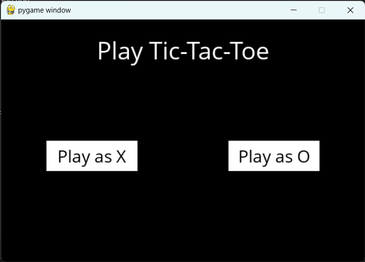
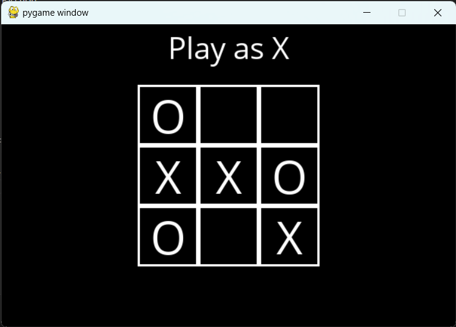

# Tic-Tac-Toe Game

A simple command-line Tic-Tac-Toe game built in Python.

## Table of Contents

- [Features](#features)
- [Requirements](#requirements)
- [How to Play](#how-to-play)
- [Game Rules](#game-rules)
- [Screenshots](#screenshots)
- [Contributing](#contributing)
- [License](#license)

## Features

- Play Tic-Tac-Toe against a friend in the command line.
- Simple and intuitive user interface.
- Randomly select which player goes first.
- Detect game results, including wins, draws, and ongoing games.
- Replay functionality for starting a new game.

## Requirements

- Python 3 (https://www.python.org/downloads/)
- pygame - a python library. install using 

    pip install pygame

## How to Play

1. Clone or download the repository to your local machine.
2. Open your terminal or command prompt.
3. Navigate to the directory where the game is located.
4. Run the game using Python:
   
    python runner.py

## Game Rules
Tic-Tac-Toe is played on a 3x3 grid. Players take turns marking a square with their assigned symbol ('X' or 'O'). The first player to get three of their symbols in a row (horizontally, vertically, or diagonally) wins the game. If all squares are filled, and no player has three in a row, the game is a draw.

## Screenshots
Include screenshots of the game in action, highlighting key features and moments.

    
    